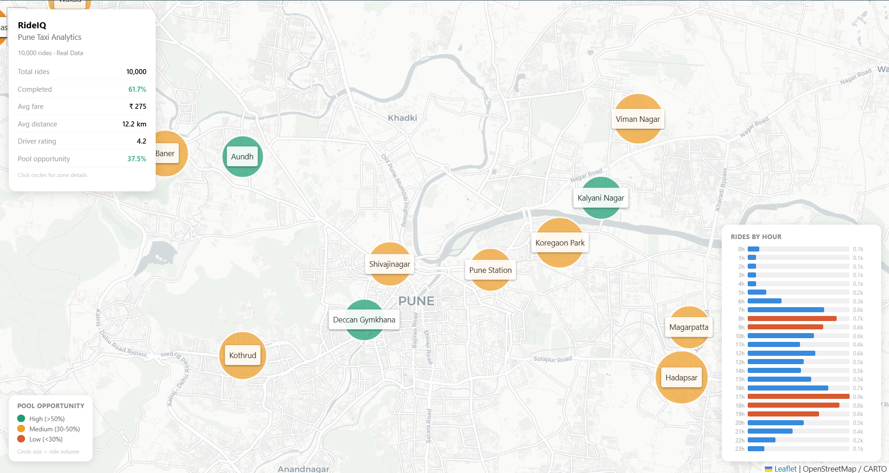
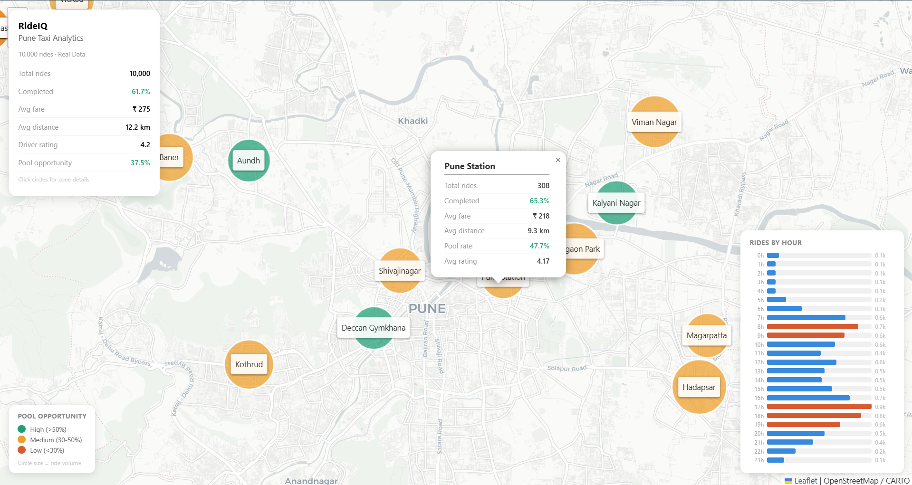
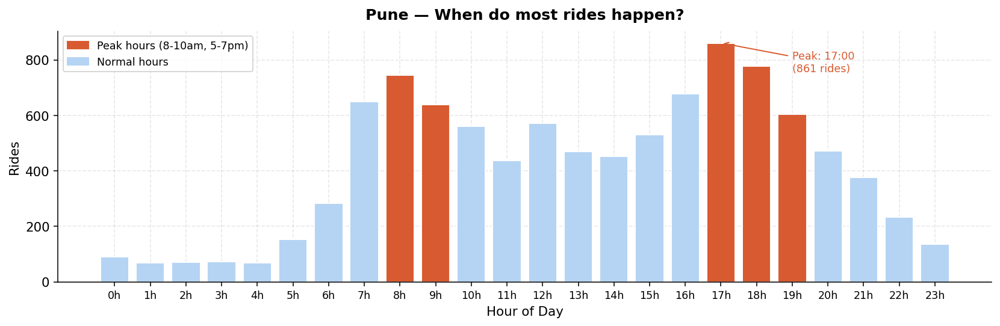
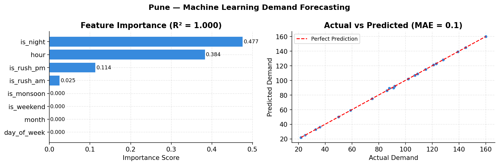

# 🚖 RideIQ – Intelligent Demand Forecasting for Smart Mobility

A Machine Learning-based ride demand forecasting and analytics platform that analyzes historical taxi booking data to generate business insights, predict ride demand, and visualize transportation patterns using interactive geospatial dashboards.

---

## 📌 Project Overview

RideIQ is an end-to-end Machine Learning and Data Analytics project developed using Python, Scikit-learn, and Jupyter Notebook. The system automatically processes taxi booking datasets, performs data preprocessing, exploratory data analysis (EDA), feature engineering, demand forecasting using Random Forest, and generates interactive visualizations to support fleet optimization and business decision-making.

---

## ✨ Features

- 📊 Automated data preprocessing and cleaning
- 🚖 Ride demand forecasting using Random Forest Regressor
- 📈 Exploratory Data Analysis (EDA)
- 🗺️ Interactive geospatial visualization using Leaflet.js
- 💳 Payment method analysis
- 🚘 Vehicle-wise ride analytics
- ⭐ Driver and customer rating analysis
- ❌ Cancellation reason analysis
- 📅 Weekday vs Weekend fare comparison
- 📍 Automatic city detection from pickup locations
- 🌆 Dynamic output generation for multiple cities
- 📁 Supports multiple datasets (Pune & NCR)

---

## 🛠️ Technology Stack

| Category | Technologies |
|----------|--------------|
| Programming Language | Python |
| Data Processing | Pandas, NumPy |
| Machine Learning | Scikit-learn (Random Forest Regressor) |
| Data Visualization | Matplotlib |
| Interactive Maps | Leaflet.js |
| Notebook | Jupyter Notebook |

---

## 📂 Project Structure

```
RideIQ/
│
├── README.md
├── requirements.txt
├── .gitignore
├── rideiq_analysis.ipynb
│
├── data/
│   ├── pune_ride_bookings.csv
│   └── ncr_ride_bookings.csv
│
├── outputs/
│   ├── pune/
│   └── ncr/
│
└── screenshots/
    ├── dashboard.png
    ├── popup.png
    ├── hourly_demand.png
    └── ml_model.png
```

---

## 🔄 Project Workflow

```
Ride Booking Dataset
          │
          ▼
Data Cleaning & Preprocessing
          │
          ▼
Feature Engineering
          │
          ▼
Exploratory Data Analysis
          │
          ▼
Machine Learning Model
(Random Forest Regressor)
          │
          ▼
Demand Prediction
          │
          ▼
Business Insights &
Interactive Visualizations
```

---

## 🤖 Machine Learning Model

### Algorithm

- Random Forest Regressor

### Input Features

- Hour
- Day of Week
- Month
- Weekend Indicator
- Morning Rush Hour
- Evening Rush Hour
- Night Indicator
- Monsoon Indicator

### Output

- Predicted Ride Demand

---

## 📊 Generated Outputs

The project automatically generates:

- 📈 Hourly Ride Demand Analysis
- 🚖 Booking Status Distribution
- 🚘 Vehicle Type Analysis
- ❌ Cancellation Analysis
- 💳 Payment Method Analysis
- ⭐ Driver vs Customer Rating Analysis
- 📅 Weekday vs Weekend Fare Analysis
- 🤖 Feature Importance Analysis
- 📉 Actual vs Predicted Demand
- 🗺️ Interactive HTML Map

---

## 📸 Screenshots

### Dashboard



---

### Interactive Map



---

### Hourly Demand Analysis



---

### ML Model Output



---

## 🚀 How to Run

### Clone Repository

```bash
git clone https://github.com/OnkarShesh/RideIQ.git
```

### Move into Project Directory

```bash
cd RideIQ
```

### Install Dependencies

```bash
pip install -r requirements.txt
```

### Select Dataset

Inside **rideiq_analysis.ipynb**

```python
CSV_FILE = "data/pune_ride_bookings.csv"
```

or

```python
CSV_FILE = "data/ncr_ride_bookings.csv"
```

### Execute

Run all notebook cells.

Generated files will be saved automatically inside:

```
outputs/pune/
```

or

```
outputs/ncr/
```

depending on the detected dataset.

---

## 📈 Future Improvements

- Real-time ride demand prediction
- REST API using FastAPI
- React Dashboard
- PostgreSQL Integration
- Docker Deployment
- Cloud Deployment (AWS / Azure)

---

## 👨‍💻 Author

**Onkar Shesh**

B.Tech – Computer Science & Business Systems

GitHub: https://github.com/OnkarShesh